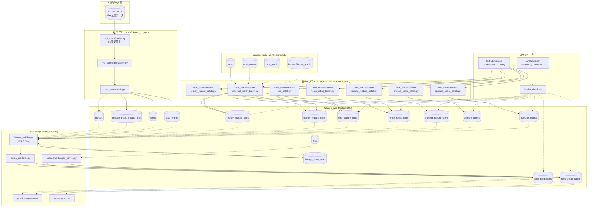

# データフロー図

> **用途**: M2 開発者画面の「DB 更新」ボタン設計の根拠資料。
> 「誰が何をどのテーブルに書くか」を責務単位で整理する。

## 凡例

- **実線矢印** `-->` : データが流れる方向（書き込み）
- **点線矢印** `-.->` : 読み取り参照
- **DB角丸ボックス** : PostgreSQL テーブル
- **太字ラベル** : 実際のスクリプト/サービス名

---

## 全体データフロー



---

## テーブル別 書き込み責務一覧

| テーブル (fukurou_jvdl) | 書き込み元 | 更新頻度 | 備考 |
|---|---|---|---|
| `races` | `jvdl_parser/sink.py` | JV-Link 受信時 | 新パイプライン |
| `race_entries` | `jvdl_parser/sink.py` | JV-Link 受信時 | 新パイプライン |
| `horses` | `jvdl_parser/sink.py` | JV-Link 受信時 | 新パイプライン |
| `lineage_map / lineage_info` | `jvdl_parser/sink.py` | JV-Link 受信時 | 新パイプライン |
| `lineage_stats_store` | `feature_builder.py` | 予測呼び出し時 UPSERT | 書き込み側は API サービス |
| `jockey_feature_store` | `jockey_trainer_batch.py` (旧) | GH Actions 月曜 | 旧パイプライン |
| `trainer_feature_store` | `jockey_trainer_batch.py` (旧) | GH Actions 月曜 | 旧パイプライン |
| `sire_feature_store` | `sire_batch.py` (旧) | GH Actions 月曜 | 旧パイプライン |
| `horse_rating_store` | `horse_rating_batch.py` (旧) | GH Actions 月曜 | 旧パイプライン |
| `training_feature_store` | `training_feature_batch.py` (旧) / `backfill_training_features.py` | GH Actions 月曜 / 手動 | 旧パイプライン |
| `chokyo_scores` | `chokyo_score_batch.py` (旧) | GH Actions 月曜 | 旧パイプライン |
| `aptitude_scores` | `aptitude_score_batch.py` (旧) | GH Actions 月曜 | 旧パイプライン |
| `race_predictions` | `batch_predictor.py` / `job_runner.py` | バッチ or ジョブキュー | 予測スコアキャッシュ |
| `race_detail_cache` | `batch_predictor.py` / `job_runner.py` | バッチ or ジョブキュー | API レスポンスキャッシュ |
| `jobs` | `api_admin/routers/jobs.py` | API 経由でエンキュー | ワーカーが消費 |

| テーブル (fukurou_keiba_v2) | 書き込み元 | 更新頻度 | 備考 |
|---|---|---|---|
| `races` | JRA スクレイパー (旧) | 月曜バッチ | 旧パイプライン。新 jvdl で代替予定 |
| `race_entries` | JRA スクレイパー (旧) | 月曜バッチ | 同上 |
| `race_results` | JRA スクレイパー (旧) | レース後バッチ | 同上 |
| `horses / horse_results` | JRA スクレイパー (旧) | 月曜バッチ | 同上 |

---

## M2「DB 更新」ボタン設計指針

開発者画面の「DB 更新」ボタンが何を呼ぶべきかは **更新したいデータの種類** で変わる:

| ボタン名（案） | 呼ぶべき処理 | 対象 DB | 所要時間 |
|---|---|---|---|
| レース/出走データ更新 | JVDL インジェスト (loader → parser → sink) | jvdl | 数秒〜数分 |
| 騎手/調教師スコア更新 | `jockey_trainer_batch.py` | jvdl | 数分 |
| 馬レーティング更新 | `horse_rating_batch.py` | jvdl | 数分 |
| 調教スコア更新 | `chokyo_score_batch.py` | jvdl | 数分 |
| 予測キャッシュ再計算 | `recompute_predictions` ジョブ (worker) | jvdl | 数分〜10分 |
| 全バッチ実行 | 上記を順次 → 予測再計算 | jvdl + keiba_v2 | 15〜30分 |

> **旧パイプライン依存の注意**: jockey/trainer/sire/horse_rating/training/chokyo/aptitude の
> feature store は現時点で `AI_FUKUROU_KEIBA_Ver2` の旧バッチが書いている。
> M2 でこれらを UI から叩く場合は、API エンドポイント経由でバッチを呼び出すか、
> worker ジョブとして移植する必要がある。

---

## 新旧パイプライン移行状況

```
旧パイプライン (AI_FUKUROU_KEIBA_Ver2)           新パイプライン (fukurou_v2_app)
─────────────────────────────────────────────    ──────────────────────────────────
JRA スクレイパー → fukurou_keiba_v2              JV-Link → jvdl_client/loader.py
web_service/batch/*.py → feature stores          （移植予定 / 現在は空白）
GitHub Actions 月曜バッチ                        jvdl_parser + APScheduler (worker)
```

**現状の懸念点**: feature store の書き込みは全て旧パイプライン依存。
GitHub Actions self-hosted runner がオフラインになると feature store が凍結する（今回の障害の根本原因）。
